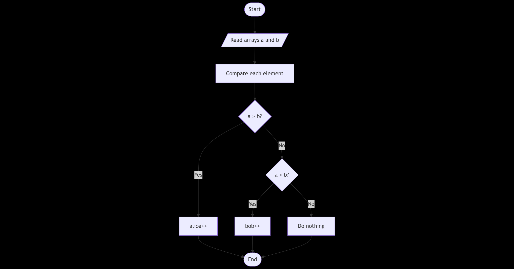
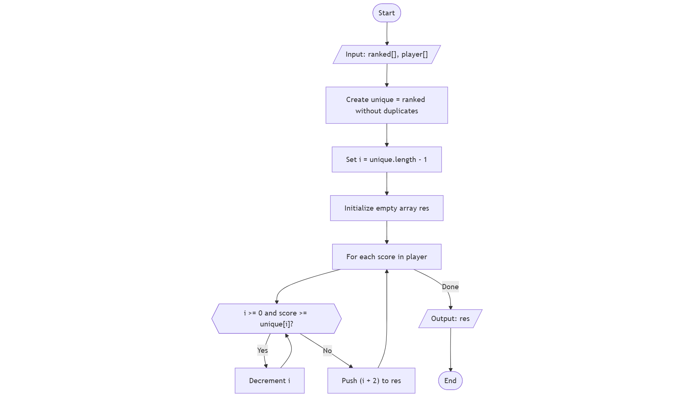
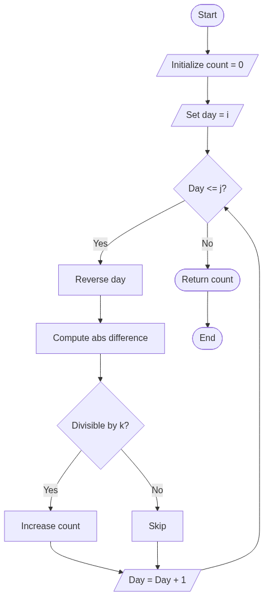
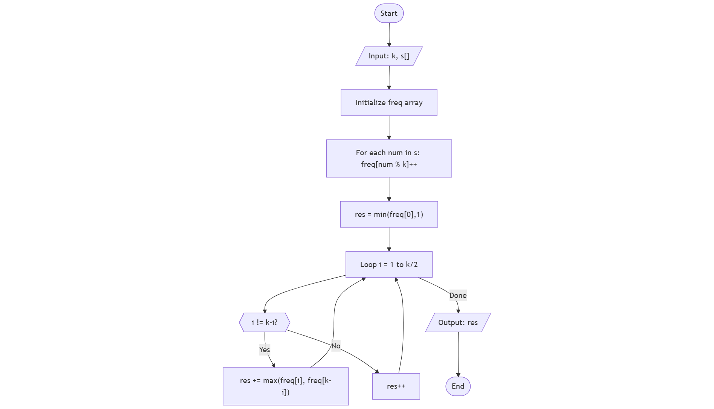
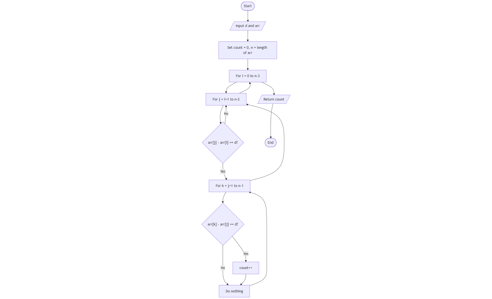

## PlusMinus
  
PlusMinus

This code counts how many numbers in an array are positive, negative, or zero and calculates what fraction of the array each type makes up. It starts with three counters for positive, negative, and zero, and stores the total number of elements. Then it goes through each number: if it’s greater than 0, the positive counter increases; if less than 0, the negative counter increases; and if it’s 0, the zero counter increases. After counting, each counter is divided by the total number of elements to get the ratio, and the results are printed with six decimal places to show the exact fractions.

## Staircase
  
Staircase

This code prints a staircase pattern of height `n` using `#` symbols. For each row from 1 to `n`, it first creates a string of spaces to push the `#` symbols to the right, then creates a string of `#` symbols equal to the row number. It then combines the spaces and `#` symbols and prints them, so each row is properly aligned, forming a staircase shape.

## MiniMaxSum
  
MiniMaxSum

This code calculates the minimum and maximum sums that can be made by adding exactly four out of five numbers in an array. It first finds the total sum of all numbers, then identifies the smallest and largest numbers in the array. The minimum sum is calculated by subtracting the largest number from the total, and the maximum sum is calculated by subtracting the smallest number. Finally, it prints both sums separated by a space.

## AveryBigSum
  
AveryBigSum

This code calculates the sum of very large numbers in an array. The `aVeryBigSum` function uses `reduce` to add up all the numbers in the array and returns the total. In the `main` function, it reads the number of elements, then reads the array from input and converts each value to an integer. It calls `aVeryBigSum` to get the total sum and writes the result to the output.

## PlusMinus
  
PlusMinus

This code counts how many numbers in an array are positive, negative, or zero and calculates what fraction of the array each type makes up. It starts with three counters for positive, negative, and zero, and stores the total number of elements. Then it goes through each number: if it’s greater than 0, the positive counter increases; if less than 0, the negative counter increases; and if it’s 0, the zero counter increases. After counting, each counter is divided by the total number of elements to get the ratio, and the results are printed with six decimal places to show the exact fractions.

## Staircase
  
Staircase

This code prints a staircase pattern of height `n` using `#` symbols. For each row from 1 to `n`, it first creates a string of spaces to push the `#` symbols to the right, then creates a string of `#` symbols equal to the row number. It then combines the spaces and `#` symbols and prints them, so each row is properly aligned, forming a staircase shape.

## MiniMaxSum
  
MiniMaxSum

This code calculates the minimum and maximum sums that can be made by adding exactly four out of five numbers in an array. It first finds the total sum of all numbers, then identifies the smallest and largest numbers in the array. The minimum sum is calculated by subtracting the largest number from the total, and the maximum sum is calculated by subtracting the smallest number. Finally, it prints both sums separated by a space.

## AveryBigSum
  
AveryBigSum

This code calculates the sum of very large numbers in an array. The `aVeryBigSum` function uses `reduce` to add up all the numbers in the array and returns the total. In the `main` function, it reads the number of elements, then reads the array from input and converts each value to an integer. It calls `aVeryBigSum` to get the total sum and writes the result to the output.

## BirthdayCakeCandles
  
BirthdayCakeCandles

This code counts how many of the tallest birthday candles there are in an array. It first finds the tallest candle using `Math.max`, then uses `filter` to create a new array with only the candles that match that height. Finally, it returns the number of tallest candles by checking the length of that filtered array.

## CompareTriplets
  
CompareTriplets

This code compares two arrays of scores, `a` and `b`, representing Alice's and Bob's points in three challenges. It starts with counters for Alice and Bob at 0. For each of the three scores, it checks which one is higher: if Alice’s score is greater, her counter increases; if Bob’s score is greater, his counter increases. At the end, it returns an array with both counters, showing how many points each of them earned.

## DiagonalDifference
  
DiagonalDifference

This code reads a square matrix from input, stores it in a 2D array, and then calculates the difference between its diagonals. It first reads `n`, the size of the matrix, then loops `n` times to read each row, splitting the input into numbers and storing them in the array. After building the matrix, it calls the `diagonalDifference` function to get the absolute difference between the sums of the two diagonals and prints the result.

## GradingStudent
  
GradingStudent

This code rounds student grades according to specific rules. For each grade, if it is less than 38, it stays the same because it’s failing. Otherwise, it calculates the next multiple of 5. If the difference between that multiple and the grade is less than 3, the grade is rounded up to the next multiple of 5; if not, the grade stays the same. The function returns a new array with all the adjusted grades.

## TimeConversion
  
TimeConversion

This code converts a time from 12-hour AM/PM format to 24-hour format. It first extracts the hour, minutes and seconds, and the AM/PM part from the input string. If it’s AM and the hour is 12, it changes the hour to 0. If it’s PM and the hour is not 12, it adds 12 to the hour. Finally, it formats the hour to always have two digits and combines it with the minutes and seconds to return the 24-hour time.

## SubArrayDivision
  
SubArrayDivision

This code counts how many ways a chocolate bar can be divided to match a birthday. The array `s` represents the chocolate squares with numbers. For each segment of length `m`, it adds up the numbers in that segment. If the sum equals `d` (the birthday day), it increases the count. At the end, it returns the total number of segments that match the birthday.

## Kangaroo
  
Kangaroo

This code checks if two kangaroos starting at different positions and jumping at different speeds will land on the same spot at the same time. First, it checks if their speeds are equal; if so, they only meet if they start at the same position. Otherwise, it calculates `n`, the number of jumps needed for them to meet. If `n` is a non-negative whole number, they will meet, so it returns "YES"; otherwise, it returns "NO".

## DivisibleSumPairs
  
DivisibleSumPairs

This code counts the number of pairs in an array whose sum is divisible by a given number `k`. It goes through each possible pair of elements in the array, adds them together, and checks if the sum is divisible by `k`. If it is, it increases the count. At the end, it returns the total number of pairs that meet this condition.

## BreakingRecords
  
BreakingRecords

This code tracks how many times a player breaks their highest and lowest score records in a series of games. It starts by setting the first score as both the maximum and minimum, with counters at 0. Then, for each following score, if it’s higher than the current maximum, the maximum is updated and the counter for breaking the high score increases. If it’s lower than the current minimum, the minimum is updated and the counter for breaking the low score increases. Finally, it returns both counters in an array.

## BetweenTwoSets
  
BetweenTwoSets

This code finds how many numbers are “between” two arrays, meaning they are multiples of all numbers in the first array and divisors of all numbers in the second array. It starts by checking numbers from the largest in the first array to the smallest in the second array. For each number, it checks if it’s divisible by every number in the first array and if it divides every number in the second array. If both conditions are true, it increases the count. At the end, it returns the total count of such numbers.

## AppleandOrange
  
AppleandOrange

This code counts how many apples and oranges fall on a house. The house is between points `s` and `t`, the apple tree is at `a`, and the orange tree is at `b`. For each apple, it adds the distance it falls to the tree position and checks if it lands on the house; if so, it increases the apple count. The same is done for oranges. Finally, it prints the number of apples and oranges that landed on the house.

## MigratoryBirds
  
MigratoryBirds

This code finds the most common type of bird in an array, and if there’s a tie, it chooses the smallest type number. It first counts how many times each bird type appears using an object. Then, it goes through the counts to find the highest frequency. If two types have the same frequency, it picks the smaller number. Finally, it returns the type of the most frequently sighted bird.

## DayOfProgrammer
  
DayOfProgrammer

This code finds the date of the “Day of the Programmer” (the 256th day of the year) for a given year. It handles three cases: in 1918, the calendar switched from Julian to Gregorian, so the day is 26th September; for leap years, it’s 12th September; and for all other years, it’s 13th September. Leap years are calculated differently depending on whether the year is before or after 1918.

## BillDivision
  
BillDivision

This code checks if Anna was charged correctly for a shared meal. The array `bill` has the prices of each item, and `k` is the item Anna didn’t eat. It calculates Anna’s share by adding up all items except the one she didn’t eat and dividing by 2. If the amount she paid `b` matches her share, it prints "Bon Appetit"; otherwise, it prints the difference she was overcharged.

## SalesByMarch
  
SalesByMarch

This code counts how many pairs of socks there are in an array. It first counts how many socks there are of each color using an object. Then, for each color, it divides the count by 2 (ignoring the remainder) to find how many pairs can be made. Finally, it adds up all the pairs and returns the total.

## DrawingBook
  
DrawingBook

This code finds the minimum number of pages to turn to reach a specific page in a book. It calculates how many turns it takes from the front by dividing the target page `p` by 2, and how many turns from the back by subtracting the front turns from half of the total pages `n`. Finally, it returns the smaller of the two numbers, giving the quickest way to reach the page.

## CountingValley
  
CountingValley

This code counts how many valleys a hiker goes through during a hike. A valley is a sequence of steps below sea level that starts with a step down and ends when the hiker comes back up to sea level. The code keeps track of the current `seaLevel`, increasing it for an 'U' step and decreasing it for a 'D' step. Each time the hiker comes up to sea level from below, the `valleys` count increases. At the end, it returns the total number of valleys.

## ElectronicShop
  
ElectronicShop

This code finds the most money you can spend on buying one keyboard and one USB drive without exceeding a budget `b`. It goes through each keyboard and each drive, calculates their combined price, and checks if it’s within the budget. If it is and it’s higher than the previous maximum, it updates the maximum spend. At the end, it returns the highest total possible, or -1 if nothing can be bought within the budget.

## CatandMouse
  
CatandMouse

This code determines which cat will catch a mouse first. It calculates the distance from Cat A (`x`) and Cat B (`y`) to the mouse (`z`). If Cat A is closer, it returns "Cat A"; if Cat B is closer, it returns "Cat B". If both cats are the same distance from the mouse, it returns "Mouse C", meaning the mouse escapes.

## PickingNumbers
  
PickingNumbers

This code finds the longest subarray where the difference between any two numbers is at most 1. It first counts how many times each number appears using a frequency array. Then, for each number, it adds its count to the count of the previous number to see the total length of a subarray containing those two numbers. It keeps track of the maximum length and returns it at the end.

## ClimbingTheLeaderBoard
  
ClimbingTheLeaderBoard

This code calculates the player’s rank on a leaderboard after each game. It first removes duplicate scores from `ranked` to get unique ranks. Then, for each of the player’s scores, it moves from the lowest rank upwards until it finds where the score fits. The player’s rank is determined by the position in the leaderboard, and the code stores all ranks in an array and returns it.

## The Hundle Race

  
The Hundle Race

This code determines the minimum number of magic potions a character needs to jump over all hurdles in a race. The function takes `k`, the character’s maximum jump height, and an array `height` representing the height of each hurdle. It first finds the tallest hurdle using `Math.max`. If the tallest hurdle is higher than the character’s jump `k`, the function calculates the difference `maxHurdle - k` to find how many potions are needed. If the character can already jump over the tallest hurdle, it returns 0.  

## DesignerPdfViewer
  
DesignerPdfViewer

This code calculates the highlighted area of a word in a PDF viewer where each letter has a specific height. The function takes `h`, an array of 26 integers representing the heights of letters 'a' to 'z', and `word`, a string to be highlighted. It iterates through each character in the word, finds its index in the alphabet using `charCodeAt(0) - 97`, and updates `maxHeight` to the tallest letter seen. Finally, it multiplies the tallest letter’s height by the length of the word to get the total area that will be highlighted.  

## UtopianTree
  
UtopianTree

This code calculates the height of a utopian tree after `n` growth cycles. The tree grows in two alternating patterns: during spring (even-numbered cycles starting from 0), the height doubles, and during summer (odd-numbered cycles), it increases by 1. The function starts with a height of 1, then loops through each cycle, applying the appropriate growth rule. Finally, it returns the tree’s height after all cycles.  

## AngryProfessor
  
AngryProfessor

This code determines whether a class will be canceled based on student arrival times. The parameter `a` is an array of arrival times, where a time ≤ 0 means the student arrived on time or early. The function counts how many students are on time and compares it to `k`, the minimum number required for the class to proceed. If the number of on-time students is at least `k`, the class is held and the function returns "NO" (not canceled); otherwise, it returns "YES" (class canceled).  

## BeautifulDaysAtTheMovie
  
BeautifulDaysAtTheMovie

This code counts how many "beautiful days" there are within a range of days from `i` to `j`. A beautiful day is defined as a day where the absolute difference between the day and its reversed digits is divisible by `k`. For each day in the range, the function reverses its digits, calculates the absolute difference with the original day, and checks if this difference is divisible by `k`. If it is, it increments a counter. At the end, it returns the total count of beautiful days.  

## ViralAdvertising
  
ViralAdvertising

This code calculates the cumulative number of people who like an advertisement over `n` days. The advertisement starts being shared with 5 people on the first day. Each day, half of the people who receive it like the ad (rounded down), and each of those who liked it shares it with 3 new people the next day. The function keeps a running total of likes in `cumulative` and updates the number of people who will see the ad (`shared`) for the next day. At the end, it returns the total number of likes after `n` days.  

## SaveThePrisoner
  
SaveThePrisoner

This code determines which prisoner will receive the last sweet when distributing `m` sweets to `n` prisoners sitting in a circle, starting from prisoner `s`. It calculates the position of the last sweet using `(s + m - 1) % n`. If the result is 0, it means the last sweet goes to the last prisoner (`n`), otherwise it returns the calculated position. This ensures the counting wraps around the circle correctly.  

## CircularArrayRotation
  
CircularArrayRotation

This code performs `k` right circular rotations on an array `a` and returns the values at specific `queries` indices after the rotations. Instead of physically rotating the array, it calculates the original index of each queried position using `(q - k + n) % n` to handle wrapping around the array. The values at these indices are collected in a new array `result`, which is then returned.  

## SequenceEquation
  
SequenceEquation

This code solves the sequence equation problem, where for each `x` from 1 to `n` (length of `p`), it finds `y` such that `p[y-1] = x` and then finds `z` such that `p[z-1] = y`. The function uses `indexOf` to find positions (adding 1 to convert from 0-based to 1-based indexing) and collects all `z` values in the `result` array, which is returned at the end.  

## JumpingOnClouds
  
JumpingOnClouds

This code simulates a player jumping on clouds in a circular array `c` with jumps of size `k`. The player starts with `100` energy at position `0`. For each jump, the position is updated using modulo to wrap around the array. Energy decreases by `1` for each jump, and by an additional `2` if the cloud landed on is a thundercloud (`c[position] === 1`). The loop continues until the player returns to the starting position. The function finally returns the remaining energy.

## FindDigits
  
FindDigits

This code counts how many digits in a number `n` evenly divide `n`. It first converts the number to a string to iterate through each digit. For each digit, it checks if the digit is not zero and if `n` is divisible by that digit. If both conditions are true, a counter is incremented. At the end, the function returns the total count of such digits.

## AppendAndDelete
  
AppendAndDelete

This code checks if it's possible to convert string `s` into string `t` using exactly `k` operations, where each operation is either deleting the last character of `s` or appending a character to `s`. It first finds the length of the common prefix of `s` and `t`. Then it calculates the minimum number of operations required by summing the characters to delete from `s` and the characters to append from `t`. The code then checks:
- If the required operations are more than `k`, it returns "No".
- If the difference between `k` and the required operations is even, it returns "Yes" (extra operations can be done by deleting and appending the same character).
- If `k` is large enough to delete all of `s` and build `t` from scratch, it returns "Yes".
- Otherwise, it returns "No".

## Sherlock And Square
  
Sherlock And Square

This code counts how many perfect squares exist between two integers `a` and `b` (inclusive).  
- It finds the smallest integer greater than or equal to √a (`start`).  
- It finds the largest integer less than or equal to √b (`end`).  
- The number of perfect squares is then `end - start + 1`.  
If there are no valid squares, the result becomes 0.

## Library Fine
  
Library Fine

This function calculates the fine for returning a library book late. If the book is returned in a later year, the fine is 10000. If it is returned in the same year but a later month, the fine is 500 multiplied by the number of months late. If it is returned in the same month but a later day, the fine is 15 multiplied by the number of days late. If the book is returned on time or earlier, the fine is 0.

## CutTheSticks
  
CutTheSticks

This function simulates cutting sticks until none are left. It begins with an array of stick lengths and records how many sticks are present before each cut. In each round, it finds the shortest stick, subtracts its length from every stick, and removes any sticks that become zero. This process repeats until no sticks remain, and the function returns an array showing the number of sticks cut in each round.

## NonDivisibleSubset
  
NonDivisibleSubset

This function finds the size of the largest subset of numbers from the array where the sum of any two numbers is not divisible by `k`. It works by counting how many numbers leave each remainder when divided by `k`. Only one number with remainder 0 can be included, since two such numbers would sum to something divisible by `k`. For each remainder pair `i` and `k - i`, the function keeps the larger group because including both would create divisible sums. If `k` is even, only one element with remainder `k/2` can be included. Finally, it returns the maximum size of such a subset.

## RepeatedString
  
RepeatedString

This function counts how many times the letter `'a'` appears in the first `n` characters of an infinitely repeated string `s`. It first counts how many `'a'` characters are in the original string. Then it calculates how many full repetitions of the string fit inside `n` and multiplies that by the `'a'` count. After that, it checks the remaining characters (the part of the string that doesn’t complete a full repeat) and counts how many `'a'` occur there. The total number of `'a'` characters is returned as the result.

## EqualizeArray
  
EqualizeArray

This function finds the minimum number of deletions required so that all elements in the array are the same. It does this by counting the frequency of each number in the array and tracking which number appears the most times. Since we want all elements equal, the best option is to keep the most frequent number and delete the rest. The result is the total array length minus the frequency of the most common element.

## QueensAttack
  
QueensAttack

This function calculates how many squares a queen can attack on an `n × n` chessboard given her position and a list of obstacles. It represents the obstacles as a set for quick lookup and defines all eight possible directions the queen can move (up, down, left, right, and the four diagonals). For each direction, the queen moves step by step until she either goes off the board or encounters an obstacle. Every valid square she can reach is counted. Finally, the function returns the total number of attackable squares.

## ACMTeam
  
ACMTeam

This function determines the maximum number of topics two team members can collectively know and how many teams can achieve that maximum. Each person’s knowledge is represented as a binary string, where `1` means they know the topic and `0` means they don’t. For every pair of people, the function counts how many topics at least one of them knows. If this number is greater than the current maximum, it updates the maximum and resets the count of teams. If it matches the maximum, it increments the count of teams. The function finally returns an array with the maximum number of topics and the number of teams that can achieve it.

## FlatlandSpaceStations

FlatlandSpaceStations

This function calculates the maximum distance any city in Flatland must travel to reach the nearest space station. It starts by sorting the array of space station locations `c`. Then, it checks the edge cities: the distance from the first city to the first station, and the distance from the last city to the last station. For cities between stations, it computes half the distance between consecutive stations, since the farthest city in between will be in the middle. The maximum of these values is the answer, representing the largest distance a city has to travel to a space station.

## FairRations

FairRations

This function distributes loaves of bread so that every person in the line has an even number. It starts with a counter `loafs` at 0. It iterates through the array `B` of loaf counts, and whenever it finds an odd number, it adds 1 loaf to that person and the next person, increasing the counter by 2. This ensures the current person becomes even while propagating the extra loaf forward. After processing everyone, if the last person has an even number of loaves, the function returns the total number of loaves distributed as a string. If the last person is still odd, it returns "NO", meaning it’s impossible to make everyone even.

## TaumAndBday

TaumAndBday

This function calculates the minimum cost to buy `b` black and `w` white gifts, considering their prices and the option to convert one type to another. It first determines the effective cost of a black gift as the minimum of its original price `bc` or the price of a white gift `wc` plus the conversion cost `z`. Similarly, it calculates the effective cost of a white gift. Finally, it multiplies the number of black and white gifts by their respective costs and returns the total cost as a BigInt to handle very large numbers.

## OrganizingContainers

OrganizingContainers

This function determines whether it is possible to organize balls in containers such that each container contains only one type of ball. It first calculates the total number of balls in each container (`rowSums`) and the total number of each ball type across all containers (`colSums`). After sorting both arrays, it compares them element by element. If all corresponding totals match, it’s possible to organize the containers, so it returns "Possible"; otherwise, it returns "Impossible".

## Encryption

Encryption

This function encodes a string by arranging its characters in a grid and then reading the characters column by column. It first removes all spaces from the input string and calculates the number of rows and columns based on the square root of the string length. The string is split into rows of the grid. Then, it constructs the encoded message by reading down each column and concatenating the characters. Spaces are added between columns in the final encrypted output.

## BiggerIsGreater

BiggerIsGreater

This function finds the next lexicographically greater permutation of a given string. It starts by scanning the string from right to left to find the first character that is smaller than its neighbor to the right. If no such character exists, the string is the highest possible permutation, so it returns "no answer". Otherwise, it finds the smallest character to the right that is larger than this character and swaps them. Finally, it reverses the substring to the right of the original character’s position to get the next greater permutation and returns it as a string.

## KaprekarNumbers

KaprekarNumbers

This code finds all Kaprekar numbers in a given range from `p` to `q`. A Kaprekar number is a number whose square can be split into two parts that sum to the original number. For each number in the range, it squares the number and converts it to a string. Then, it splits the square into a right part with the same number of digits as the original number, and the remaining left part. If the sum of the left and right parts equals the original number, it’s a Kaprekar number and is added to the results. At the end, it prints all Kaprekar numbers separated by spaces, or "INVALID RANGE" if none are found.

## BeautifulTriplets

BeautifulTriplets

This code counts how many "beautiful triplets" exist in an array. A beautiful triplet is a sequence of three numbers `(arr[i], arr[j], arr[k])` such that the difference between consecutive numbers is exactly `d`. The code loops through each possible triplet in the array: for each `i`, it checks for `j` where `arr[j] - arr[i] === d`, and for each such `j`, it checks for `k` where `arr[k] - arr[j] === d`. Every time a valid triplet is found, the count is increased. At the end, the function returns the total number of beautiful triplets.

## MinimumDistances

MinimumDistances

This code finds the minimum distance between any two equal elements in an array. It starts by initializing `minDist` to infinity and creating a `Map` to store the last seen positions of elements. Then it loops through the array: if the current element has been seen before, it calculates the distance from its previous occurrence and updates `minDist` if the distance is smaller. Each element's current index is then stored in the map. After checking all elements, if `minDist` is still infinity, it means there were no repeating elements, so the function returns `-1`; otherwise, it returns the smallest distance found.

## HowManyGames

HowManyGames

This code calculates how many games can be bought given a starting price, a discount, a minimum price, and a budget. It starts with a `count` of 0 and sets the current `price` to the initial game price `p`. In a loop, as long as the remaining budget `s` is enough to buy the game, it subtracts the current price from the budget, increases the `count`, and then decreases the price by the discount `d`, ensuring it does not go below the minimum price `m`. The loop continues until the budget cannot cover the current price. Finally, it returns the total number of games bought.

## TimeInWords

TimeInWords

This code converts a given time in hours `h` and minutes `m` into a phrase using words. It defines an array `words` containing the textual representation of numbers from zero to twenty-nine. The function then checks for special cases: if `m` is 0, it returns "o' clock"; if `m` is 15 or 45, it returns "quarter past" or "quarter to" the hour; if `m` is 30, it returns "half past" the hour. For other values, if `m` is less than 30, it returns "`m` minutes past `h`"; if `m` is greater than 30, it returns "`60 - m` minutes to `h + 1`", correctly handling singular and plural minutes. This produces the full spoken form of the time.

## ChocolateFeast

ChocolateFeast

This code calculates how many chocolates can be eaten given a starting amount of money `n`, chocolate cost `c`, and a wrapper exchange rate `m`. First, it determines how many chocolates can be bought initially with the money and sets the number of wrappers equal to that. Then, while the number of wrappers is enough to exchange for at least one more chocolate (`wrappers >= m`), it calculates how many new chocolates can be obtained from wrappers, adds them to the total chocolates eaten, and updates the wrapper count to the leftover wrappers plus the new chocolates’ wrappers. Finally, it returns the total number of chocolates eaten.

## ServiceLane

ServiceLane

This code determines the largest vehicle that can pass through a service lane segment for multiple test cases. The array `width` represents the width of each segment of the lane. For each case, defined by an entry and exit index, it finds the minimum width within that segment, because the largest vehicle that can pass is limited by the narrowest point. It stores the minimum width for each case in a `results` array and returns this array at the end.

